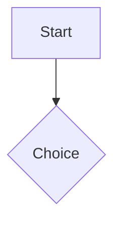

# Title that the theme prints

An opening paragraph with `inline code`, **strong**, *emphasis*, a
[relative link](./other.md), an [anchor](#labeling) and an
[external one](https://example.com/a?b=1&c=2). Brackets like [1] and an
em dash -- stay put.

## A heading

### Duplicate

### Duplicate

## Labeling {#labeling}

- First item
- Second item with a nested list:
  1. Nested one
  2. Nested `two`
- Third

3. Ordered from three
4. And four

```typescript
const escaped = a < b && arr[0];
```

```
No language here
```



> A quotation.
>
> With two paragraphs.

| Left | Center | Right | Plain |
| :--- | :----: | ----: | --- |
| a | b | c | d |

---

:::note
A note with `code` in it.
:::

:::warning[Read this first]
A labelled admonition.
:::
